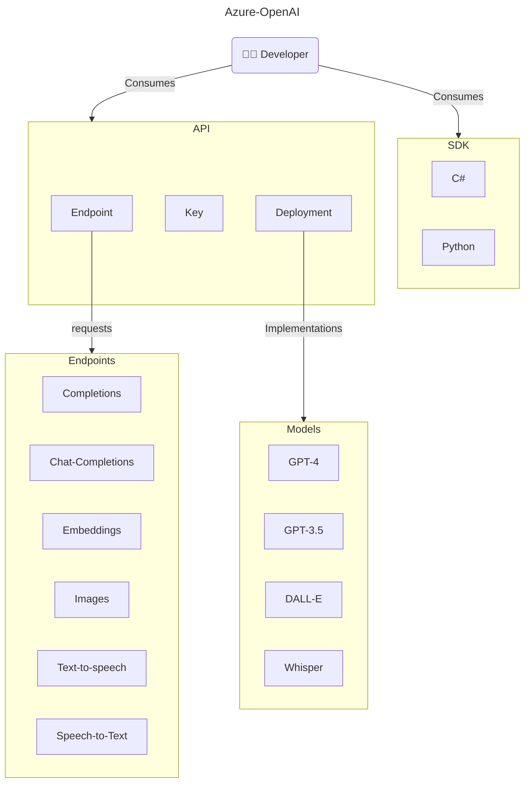

# [Develop Generative AI solutions with Azure OpenAI Service](https://learn.microsoft.com/en-us/training/paths/develop-ai-solutions-azure-openai/) course notes

```mermaid
---
title: Azure-OpenAI
---
flowchart
        
    subgraph SDK
        C#
        Python
    end

    subgraph API
        Endpoint
        Key
        Deployment
    end

    subgraph Endpoints
        Completions
        Chat-Completions
        Embeddings
        Images
        Text-to-speech
        Speech-to-Text
    end       

    subgraph Models
        GPT-4
        GPT-3.5
        Embeddings
        DALL-E
        Whisper
        Text-to-speech
    end

        dev("👩‍💻 Developer") -- "Consumes" --> API & SDK
        Deployment -- "Implementations" --> Models
        Endpoint -- "requests" --> Endpoints
```
