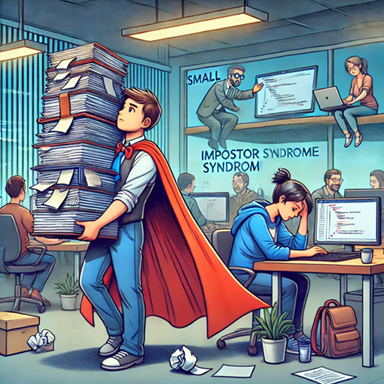

# Resumen de: [Overcoming Impostor & Hero Syndromes: Strategies for a Healthier DevOps Culture](https://dev.to/allanpablo/overcoming-impostor-hero-syndromes-strategies-for-a-healthier-devops-culture-5fec)

> Superando el Síndrome del Impostor y el Heroísmo en DevOps 🚀
--------

--------

En el mundo de DevOps, no solo hay que preocuparse por pipelines y despliegues, sino también por el bienestar emocional del equipo. Hay dos problemas comunes: el Síndrome del Impostor (cuando alguien siente que no merece su éxito) y el Heroísmo en el trabajo (cuando una persona carga con todo el peso del equipo como si fuera un superhéroe). Ambos pueden afectar la productividad y la cultura del equipo. Veamos cómo enfrentarlos.
🤯 Síndrome del Impostor: ¿Realmente no sabes nada?

Si sientes que en cualquier momento te descubrirán como un "fraude", aunque tengas logros y conocimientos, podrías estar sufriendo este síndrome. Algunas señales son:

* Perfeccionismo extremo.
* Miedo a tomar nuevos retos.
* No aceptar reconocimientos o compartir méritos.

## 🔧 ¿Cómo manejarlo?

* Feedback positivo: Recibir comentarios constantes ayuda a reforzar la confianza en tus habilidades.
* Mentoría: Aprender de alguien más experimentado o ayudar a otros refuerza la seguridad en lo que sabes.

## 🦸‍♂️ Heroísmo: No necesitas salvar al mundo tú solo

Ser el "héroe" del equipo puede parecer bueno, pero en realidad oculta problemas como mala distribución de trabajo o falta de recursos. Esto lleva a estrés, agotamiento y desmotivación.

## 🔧 ¿Cómo evitarlo?

* Trabajo en equipo real: Distribuir tareas de manera justa para que nadie cargue con todo.
* Gestión transparente de recursos: Si falta algo, en vez de compensarlo con esfuerzo extra, hay que resolverlo en equipo.

## 👥 El rol del líder en una cultura DevOps sana

Los managers tienen la responsabilidad de equilibrar la eficiencia técnica con el bienestar del equipo. Para eso pueden:

* Crear espacios seguros para hablar: Un equipo que se siente escuchado trabaja mejor
* Fomentar el aprendizaje continuo: Sentirse valorado y en crecimiento reduce la ansiedad y la inseguridad.
* Liderar con empatía: Un buen líder entiende a su equipo y promueve una cultura de apoyo y confianza.

## 🎯 Conclusión

Ni el Síndrome del Impostor ni el Heroísmo laboral son buenos compañeros en un equipo DevOps. Pero con un liderazgo consciente y una cultura de trabajo justa y equilibrada, se pueden convertir en oportunidades para fortalecer al equipo. Al final, un equipo sano es un equipo más innovador y exitoso. 💡🚀